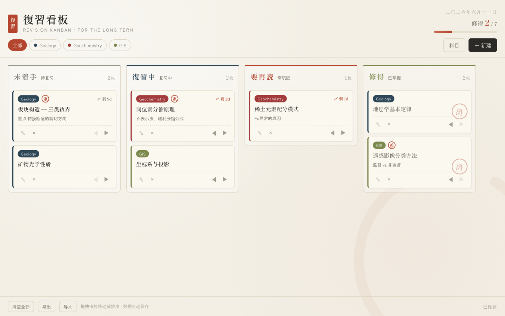

<div align="center">


# 復習看板 · Revision Kanban

**一块和风纸感的复习看板,为长期记忆而生。**

A wabi-sabi style revision kanban for the long term — single-file web app, also packaged as a desktop app (macOS & Windows) with Electron.



</div>

---

## 这是什么

復習看板是一个极简的复习进度管理工具。把要复习的知识点做成卡片,按掌握程度在四列之间流转:

| 未着手 | 復習中 | 要再読 | 修得 |
|:---:|:---:|:---:|:---:|
| 待复习 | 复习中 | 需巩固 | 已掌握 |

整个应用是**一个 HTML 文件**(`revision-kanban.html`),无任何运行时依赖——双击就能在浏览器里用,也可以打包成 macOS / Windows 桌面应用。

## 功能

- **科目分类** — 自定义科目和配色,顶部标签一键筛选
- **拖拽流转** — 卡片可在列间拖动,也支持列内拖拽排序;触屏设备可用 ◀ ▶ 按钮
- **截止日提醒** — 标「〆」记号,临期 3 天内变朱红,逾期显示天数
- **重点印章** — 重要卡片盖一枚圆形「重」印
- **修得済印** — 移入「修得」列的卡片自动盖上旋转的「済」朱印
- **进度统计** — 页眉实时显示掌握进度条
- **自动保存** — 数据存在本地(`localStorage` / Electron user data),无需账号、无需联网
- **导出 / 导入** — 一键备份为 JSON 文件,随时恢复

### 日式设计细节

明朝体标题、汉数字日期、暖帘式列色带、纸张噪点纹理、右下角一笔淡淡的円相(ensō)。没有多余的颜色,只有纸、墨与朱。

## 使用方式

### 方式一:浏览器直接打开

```bash
open revision-kanban.html
```

无需安装任何东西。数据保存在浏览器 `localStorage` 中。

### 方式二:桌面 App(macOS / Windows)

从 [Releases](../../releases) 下载对应平台的安装包:

| 平台 | 文件 |
|---|---|
| macOS(Apple Silicon) | `復習看板-1.0.0-arm64.dmg` |
| macOS(Intel) | `復習看板-1.0.0.dmg` |
| Windows 10/11(x64) | `復習看板-Setup-1.0.0.exe` |

或自行构建:

```bash
npm install                       # 安装 Electron 与 electron-builder
npm start                         # 开发模式直接运行
npm run dist                      # 打包 macOS(x64 + arm64)
npx electron-builder --mac --win  # macOS 与 Windows 一起打包
```

> **未做代码签名。**
> macOS:从网络下载的副本首次打开需右键 →「打开」绕过 Gatekeeper(本机构建无此问题)。
> Windows:SmartScreen 弹窗时点「更多信息」→「仍要运行」。

## 数据存储

| 环境 | 位置 |
|---|---|
| 浏览器 | `localStorage`(键 `revision-kanban:v2`) |
| macOS App | `~/Library/Application Support/revision-kanban/` |
| Windows App | `%APPDATA%\revision-kanban\` |

浏览器与桌面 App 数据互不相通,可用「导出 / 导入」迁移。

## 项目结构

```
.
├── revision-kanban.html   # 应用本体(HTML + CSS + JS,单文件)
├── main.js                # Electron 主进程
├── package.json
├── build/
│   ├── icon.icns          # macOS 应用图标
│   └── icon.png           # Windows 应用图标源(自动转 .ico)
└── docs/                  # README 配图
```

## License

MIT
